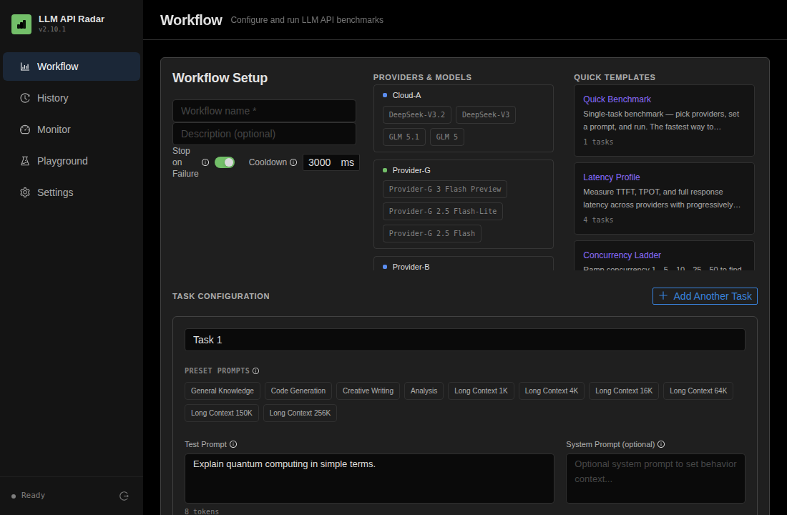
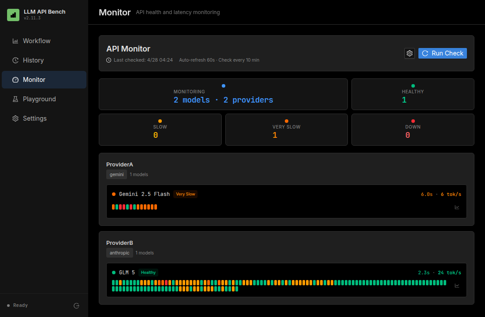
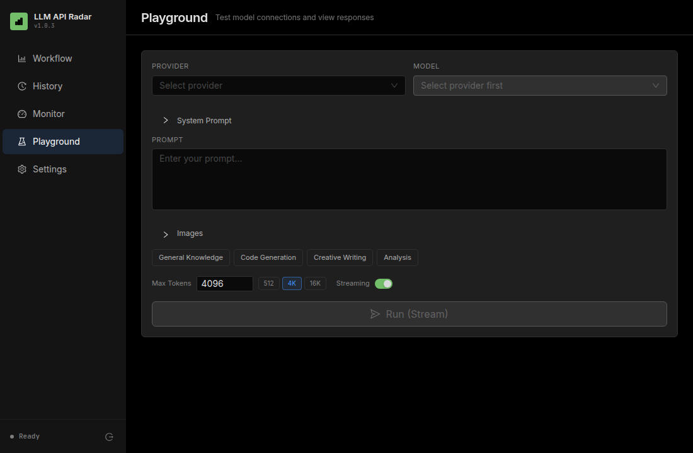
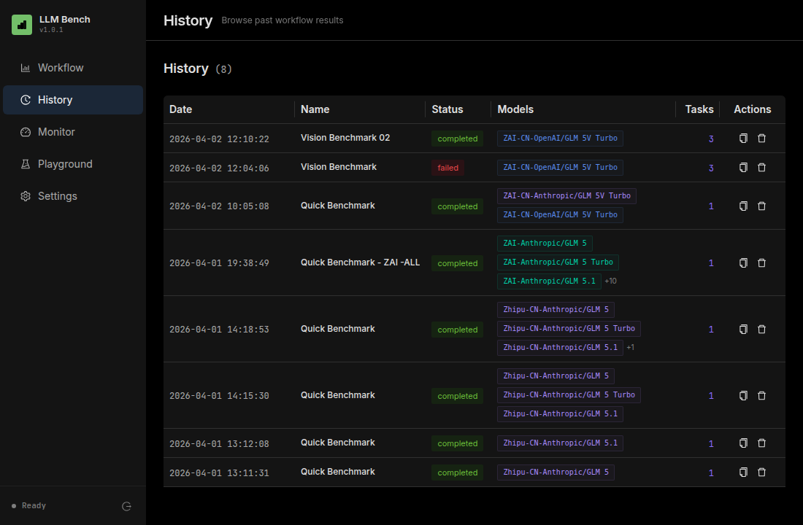

# LLM API Radar

**English** | [中文](README-cn.md)

[](https://github.com/idemerge/llm-api-radar/stargazers)
[](https://github.com/idemerge/llm-api-radar/releases)
[](https://hub.docker.com/r/idemerge/llm-api-radar)
[](LICENSE)

**Self-hosted LLM performance testing and monitoring platform.**

Benchmark, monitor, and compare LLM API providers in one place — measure latency, TTFT, throughput, and reliability across OpenAI, Anthropic, Google Gemini, and any OpenAI-compatible endpoint. Deploy with a single command via Docker or script.

---

## Why LLM API Radar?

Running LLMs in production means juggling multiple providers, each with different latency profiles, rate limits, and reliability. Public benchmarks don't reflect **your** network, **your** prompts, or **your** traffic patterns. LLM API Radar is a self-hosted tool that lets you:

- **Benchmark** — Compare providers head-to-head with identical prompts, configurable concurrency (1–50), and warmup runs
- **Monitor** — Continuously health-check your providers with four-tier status (healthy / slow / very slow / down) and 24h history
- **Playground** — Interactively test any model with streaming, vision, and full token-level metrics
- **Track** — Persistent history of all runs with side-by-side comparison and CSV/JSON export
- **Deploy** — One-command setup via Docker Compose or shell script, single `.env` for all config

## Demo

<p align="center">
  
</p>

## Screenshots

<table>
  <tr>
    <td align="center"><b>Workflow — Configure & Run</b></td>
    <td align="center"><b>Monitor — Health Checks</b></td>
  </tr>
  <tr>
    <td></td>
    <td></td>
  </tr>
  <tr>
    <td align="center"><b>Playground — Test Models</b></td>
    <td align="center"><b>History — Past Runs</b></td>
  </tr>
  <tr>
    <td></td>
    <td></td>
  </tr>
</table>

## Features

### Multi-Provider Support

- **OpenAI** — GPT-4o, GPT-4o-mini, o1, o3, and more
- **Anthropic** — Claude 4 Sonnet, Opus, Haiku
- **Google Gemini** — 2.5 Pro, Flash
- **OpenAI-Compatible** — DeepSeek, Mistral, local LLMs (Ollama, vLLM), and other endpoints that speak the OpenAI protocol

### Comprehensive Metrics

| Metric              | Description                                |
| ------------------- | ------------------------------------------ |
| Response Time       | Average / P50 / P95 / P99 latency          |
| Token Speed         | Input & output tokens per second           |
| TTFT                | Time to First Token (streaming)            |
| Throughput          | Requests/sec under concurrent load         |
| Success Rate        | Completed vs failed requests               |
| Cost Estimation     | Per-provider cost breakdown                |

### Real-Time Visualization

- Live streaming metrics during benchmark execution
- Per-provider area charts (response time, token speed)
- Radar comparison across all dimensions
- Color-coded provider identity throughout

### Workflow Engine

- Multi-task workflows with sequential execution
- Per-task prompt, concurrency, and iteration config
- Quick presets — 512 / 4K / 16K tokens, 1–10 concurrency
- Warmup runs to eliminate cold-start bias

### Playground

- Send a prompt to a specific provider/model and inspect the response
- Supports streaming and non-streaming modes
- Vision support — test multimodal models with image URLs or uploads
- Shows token counts, TTFT, TPS, and response time

### Monitor

- Periodic health checks for selected provider/model combinations
- Rich metrics per probe: TTFT, output tokens, response validation
- Configurable health thresholds (latency, TTFT, min output tokens)
- Per-model check intervals (5 min – 6 hours), global default
- Provider-parallel, model-serial scheduling
- 24h history bar with color-coded health status
- Auto-refresh dashboard with summary stats

### Authentication

- JWT-based login with configurable credentials
- Protected API routes and frontend routing
- Auto-redirect to login page on session expiry

### History & Export

- Persistent run history with full result details
- Side-by-side comparison of past runs
- Export results as JSON or CSV

### Deployment

- One-click build script (`start.sh`)
- Docker Compose with SQLite volume persistence
- Single `.env` file for all configuration

## Quick Start

### Option 1: One-Click Script (Production)

```bash
git clone https://github.com/idemerge/llm-api-radar.git
cd llm-benchmark
cp .env.example .env    # edit .env to set credentials
chmod +x start.sh && ./start.sh
```

### Option 2: Docker Compose (Production)

```bash
git clone https://github.com/idemerge/llm-api-radar.git
cd llm-benchmark
cp .env.example .env    # edit .env to set credentials
docker compose up -d
```

### Option 3: Development

```bash
git clone https://github.com/idemerge/llm-api-radar.git
cd llm-benchmark
cp .env.example .env

# Backend
cd backend && npm install && npm run dev &

# Frontend
cd ../frontend && npm install && npm run dev
```

Open `http://localhost:5173` (dev) or `http://localhost:3001` (production) to access the dashboard.

### Configuration

All configuration is managed via a single `.env` file in the project root:

| Variable | Default | Description |
| --- | --- | --- |
| `PORT` | `3001` | Server port |
| `AUTH_USERNAME` | `admin` | Login username |
| `AUTH_PASSWORD` | `changeme` | Login password |
| `JWT_SECRET` | `your-secret-key-here` | JWT signing secret (change before deploying) |
| `JWT_EXPIRES_IN` | `24h` | JWT token expiry |

### Connect Real Providers

1. Log in with your credentials
2. Go to **Settings**
3. Click **Add Provider**
4. Select a format (OpenAI / Anthropic / Gemini / OpenAI-Compatible)
5. Enter your API endpoint and key
6. Click **Test Connection** to verify
7. Start benchmarking!

## Architecture

```
┌─────────────────────────────────────────────────────────┐
│                        Browser                          │
│  React 19 · Ant Design 5 · Recharts · Tailwind CSS v4  │
└────────────────────────┬────────────────────────────────┘
                         │ REST / SSE
┌────────────────────────▼────────────────────────────────┐
│                   Express Server                        │
│  ┌──────────┐  ┌───────────┐  ┌──────────────────────┐  │
│  │ Auth     │  │ REST API  │  │ SSE Stream           │  │
│  │ (JWT)    │  │ /api/*    │  │ /api/workflows/:id   │  │
│  └──────────┘  └─────┬─────┘  └──────────┬───────────┘  │
│                      │                   │              │
│  ┌───────────────────▼───────────────────▼───────────┐  │
│  │              Service Layer                        │  │
│  │  Benchmark Engine · Workflow Runner · Playground   │  │
│  │  Monitor Scheduler (node-cron)                    │  │
│  └───────────────────┬───────────────────────────────┘  │
│                      │                                  │
│  ┌───────────────────▼───────────────────────────────┐  │
│  │           Provider Adapters                       │  │
│  │  OpenAI · Anthropic · Gemini · OpenAI-Compatible  │  │
│  └───────────────────┬───────────────────────────────┘  │
└──────────────────────┼──────────────────────────────────┘
                       │
          ┌────────────▼────────────┐
          │   SQLite (better-sqlite3) │
          │   Single-file database  │
          └─────────────────────────┘
```

The entire stack runs as a **single Node.js process** — no Redis, no Postgres, no external dependencies. The frontend is built by Vite and served as static files by Express. SQLite stores all benchmarks, workflows, monitor history, and provider config in one file, making backup and migration trivial.

| Layer     | Stack                                        |
| --------- | -------------------------------------------- |
| Frontend  | React 19, Vite 8, TypeScript, Tailwind CSS v4 |
| UI        | Ant Design 5 (dark theme), Recharts, Framer Motion |
| Backend   | Node.js, Express 4, TypeScript               |
| Auth      | JWT (jsonwebtoken + bcryptjs)                |
| Storage   | SQLite (better-sqlite3, raw SQL, no ORM)     |
| Scheduler | node-cron                                    |
| Deploy    | Docker (multi-stage alpine) / Shell script   |

## Star History

[](https://star-history.com/#idemerge/llm-api-radar&Date)

## Contributing

See [CONTRIBUTING.md](CONTRIBUTING.md) for development setup and guidelines.

## License

[MIT](LICENSE)
